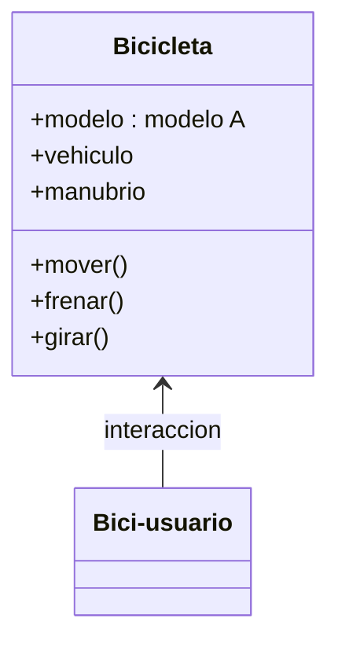
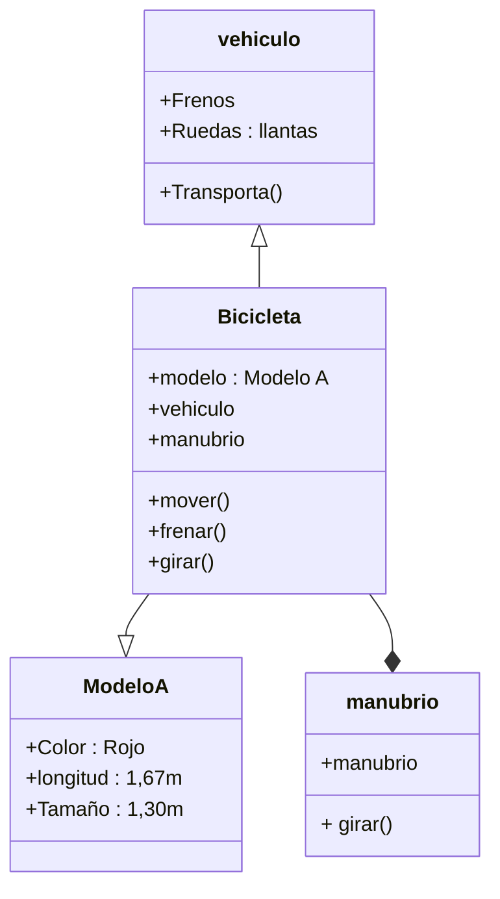

# Reto_2: Modelar una situacion de la vida real.
Por medio de los diagramas tipo UML vistos en clase, vamos a modelar un evento de la vida cotidiana haciendo uso de clases y objetos vistos previamente. Como la situación a modelar era de libre elección opte por modelar a través de clases y objetos, una interacción de un bici-usuario, con una bicicleta .

## Relacion basica con el usuario y la bicicleta.

    classDiagram
       class Bicicleta{
            +modelo
            +vehiculo
            +manubrio
            +mover ()
            +frenar ()
            +girar()
        }
        class Bici-usuario{
        }
        Bicicleta <-- Bici-usuario : interaccion

   **El usuario (clase) interactua con la bicicleta (otra clase)**

## Reación de la bicicleta y sus componentes

    
    classDiagram
        class Bicicleta{
            +modelo
            +vehiculo
            +manubrio
            +mover ()
            +frenar ()
            +girar()
        }
    
        class vehiculo {
            +Frenos 
            +Ruedas 
            +Transporta()
        }
        class Modelo A{
            +Color 
            +longitud
            +Tamaño
        }
        vehiculo<|-- Bicicleta
        Bicicleta--|> Modelo A
        class manubrio {
            +manubrio
            + girar()
        }
        Bicicleta--* manubrio

   ** la bicicleta es un vehiculo, lo cual hereda sus caracteristicas y acciones. la bicicleta es un modelo 
    

